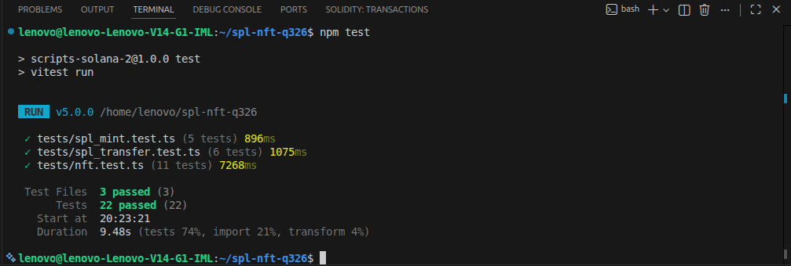

# SPL Token & NFT on Solana Devnet

Scripts that mint and transfer an SPL token, mint an NFT with **MPL Core**, and update
that NFT's name and metadata as its update authority — all on Solana devnet.

Every result below is live on devnet and verified by the test suite (`npm test`).

**Wallet:** [`8XZ6xMRiAPPEYnoY4Rf1NgvUhkkbWGZE3ceMa5cZErZ6`](https://explorer.solana.com/address/8XZ6xMRiAPPEYnoY4Rf1NgvUhkkbWGZE3ceMa5cZErZ6?cluster=devnet)

---

## 1. SPL token

Created a mint, minted 100 tokens into my associated token account, and transferred
25 of them to another wallet.

| | |
|---|---|
| Mint | [`29doABEN4W5E1NZEZStVxHtrrvD44L1Mj62b2t8iZZtj`](https://explorer.solana.com/address/29doABEN4W5E1NZEZStVxHtrrvD44L1Mj62b2t8iZZtj?cluster=devnet) |
| Decimals | 6 |
| Supply | 100 tokens (`100000000` raw units) |
| Mint authority | my wallet |

| Step | Signature |
|---|---|
| Create mint | [`4RBUf2gu…`](https://explorer.solana.com/tx/4RBUf2guydZVLJP2ndrTWBiGerqNTzRj8DD7LCFD34ZDejSn3FU8fGaAWFCiMVnXgCLd51qs4iDeeBD1HHTGtczA?cluster=devnet) |
| Mint 100 tokens | [`2BsRFkdU…`](https://explorer.solana.com/tx/2BsRFkdUGiiJo5yJUaNifGdn2JK6ejShqVV6aSPtTNML3LzawSn7cyGksmenKjEPsWNCEg41TDKRYLws6QEaZ6T5?cluster=devnet) |
| Transfer 25 tokens | [`5co8djfY…`](https://explorer.solana.com/tx/5co8djfY8eAGqiigTyhVrHi8EJnwG7Yfv7MmWxetdhzNPyKraY9eKPwXmR1MfZTDVHBZ6VZ9qKPUNQjWqaGe7o8R?cluster=devnet) |

Token accounts:

| Owner | ATA | Balance |
|---|---|---|
| [`8XZ6xMRi…`](https://explorer.solana.com/address/8XZ6xMRiAPPEYnoY4Rf1NgvUhkkbWGZE3ceMa5cZErZ6?cluster=devnet) (me) | [`6zXuSJdx…`](https://explorer.solana.com/address/6zXuSJdxwYZiyuZNC8C69VLD7hUmvry22AqXmyQF1ZvW?cluster=devnet) | 50 |
| [`aczhoP2N…`](https://explorer.solana.com/address/aczhoP2NX5KzCB4s4Xw8FXDxLcw3gVnWnkRDhBt935E?cluster=devnet) | [`4hk7ShZY…`](https://explorer.solana.com/address/4hk7ShZYNCXhfpQ6v9Sm7rfgySd8CTnasGxNwwib4Vi9?cluster=devnet) | 25 |
| [`9EUd4VNc…`](https://explorer.solana.com/address/9EUd4VNcjMAysd7zQk3Q1a4tb28BYndLNBAQDiYnHJ64?cluster=devnet) | [`3kNp8K1G…`](https://explorer.solana.com/address/3kNp8K1GTtvNEMjGrda3ixbpc4395DiTzZ5i3xUNA8ym?cluster=devnet) | 25 |

## 2. NFT (MPL Core)

Uploaded the image and a metadata JSON to Irys, then minted the asset.

| | |
|---|---|
| Asset | [`DEPzJiQk2Akq2D4moipxQGfLE8aP2jeBtmnQb1t7XVMv`](https://explorer.solana.com/address/DEPzJiQk2Akq2D4moipxQGfLE8aP2jeBtmnQb1t7XVMv?cluster=devnet) |
| Owner | my wallet |
| Update authority | my wallet |
| Image | [`58ibBiK2…`](https://gateway.irys.xyz/58ibBiK263ifDeqzqaMGMfAnFa2Nqxr5qN1M597AW95f) |
| Signature | [`4mAXXVo6…`](https://explorer.solana.com/tx/4mAXXVo6gAKeqRxFCZETxsG4MKji9uhAjVHHntmfiWJMN2aNhdLTdFwRcYeyNSTizniY72VWir6GqVGPj8ysvnj5?cluster=devnet) |

## 3. Updating the NFT

Uploaded a revised metadata JSON, then changed the on-chain name and URI as the
asset's update authority.

| | Before | After |
|---|---|---|
| Name | `My NFT` | `My Updated NFT` |
| Metadata URI | [`CaV2Z2ac…`](https://gateway.irys.xyz/CaV2Z2acs3325MkyE9jYw1T3xC9DJwBaGWL1pgQBqKfW) | [`Hs6ho3vS…`](https://gateway.irys.xyz/Hs6ho3vSQCQ1hPuBxacKhZBhP8v9u1p1jnVQ6dDUDrVE) |
| Rarity | `Common` | `Legendary` |

Signature: [`3kJZ9mdw…`](https://explorer.solana.com/tx/3kJZ9mdwFYDMdDuT6KCBzF5HFDzyPhWqmgCBLFXcyGp7npytfyfGLvNbAWWNDKyTqaJeicWAbDLvD6wfCo8RjBKV?cluster=devnet)

---

## Setup

```bash
npm install
```

Place a devnet keypair (a JSON array of 64 numbers) at the project root as
`devnet-wallet.json`, and the image to mint as `_.jpeg`. Fund the wallet with
`solana airdrop 2 --url devnet`.

The public devnet RPC rate-limits heavily. To use your own, set:

```bash
export SOLANA_RPC_URL="https://devnet.helius-rpc.com/?api-key=..."
```

## Running the scripts

```bash
npm run spl:init       # create the mint account
npm run spl:mint       # create the ATA and mint 100 tokens
npm run spl:transfer   # transfer 25 tokens

npm run nft:image      # upload the image     → image URI
npm run nft:metadata   # upload the JSON      → metadata URI
npm run nft:mint       # mint the MPL Core asset
npm run nft:update     # update the name and metadata
```

Run them in order. Each script prints an address or URI that goes into the next one —
paste it into the constant at the top of the following script before running it.

## Tests

```bash
npm test
```

22 tests across 3 files, using [Vitest](https://vitest.dev/). They require no wallet
and no SOL — every assertion is a public read against devnet, so the results above can
be verified independently by cloning the repo and running them.

| File | Covers |
|---|---|
| `tests/spl_mint.test.ts` | decimals, supply, mint authority, freeze authority |
| `tests/spl_transfer.test.ts` | ATA derivation, owners, balances, account state |
| `tests/nft.test.ts` | asset, owner, update authority, updated name and metadata |

ATA addresses are derived from their seeds with `findAssociatedTokenPda` rather than
hardcoded, so the tests prove the tokens sit at the canonical address wallets look
them up by.



---

## How it works

**Two SDKs.** The SPL scripts use [`@solana/kit`](https://www.solanakit.com/) with
`@solana-program/token`; the NFT scripts use [Umi](https://developers.metaplex.com/umi)
with `@metaplex-foundation/mpl-core`. They don't interoperate — only base58 address
strings pass between them.

**Mint vs token account.** The mint defines the token — supply, decimals, authorities —
and never holds a balance. Balances live in token accounts, one per owner per mint, at
an Associated Token Account address derived from `[owner, token_program, mint]`.

**Decimals are display-only.** With 6 decimals, "100 tokens" is stored on chain as
`100000000`. Instructions and tests work in raw units.

**NFT metadata is two uploads.** The image is uploaded first, then a JSON document
referencing that image URI is uploaded second. Only the JSON's URI is stored on chain,
alongside the name.

**Owner vs update authority.** MPL Core keeps these as separate fields. The owner can
transfer or burn the asset; the update authority can change its name and metadata URI.
`nft_update.ts` passes no `authority`, so Umi defaults to `umi.identity` — the
transaction succeeds because that wallet holds that role.

## References

- [Solana — Tokens](https://solana.com/docs/tokens)
- [Solana — Program Derived Addresses](https://solana.com/docs/core/pda)
- [Solana Kit](https://www.solanakit.com/)
- [Metaplex Core](https://developers.metaplex.com/core)
- [Umi](https://developers.metaplex.com/umi)
